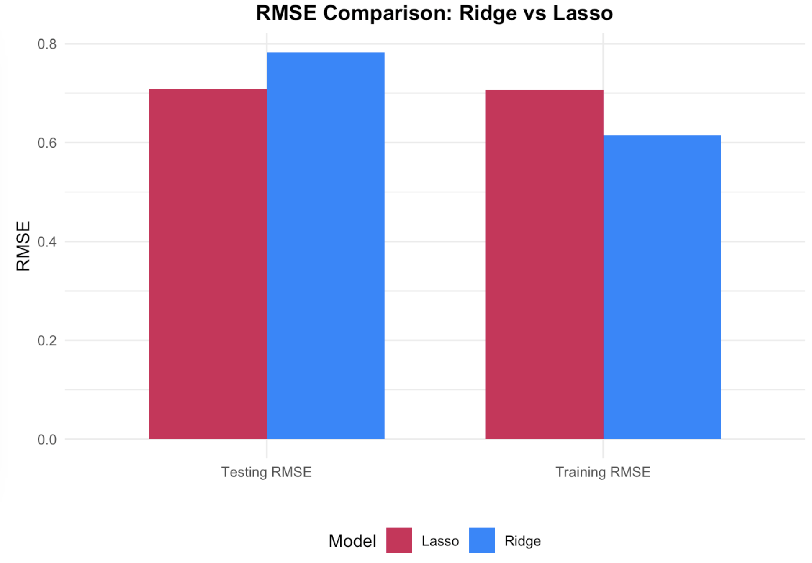
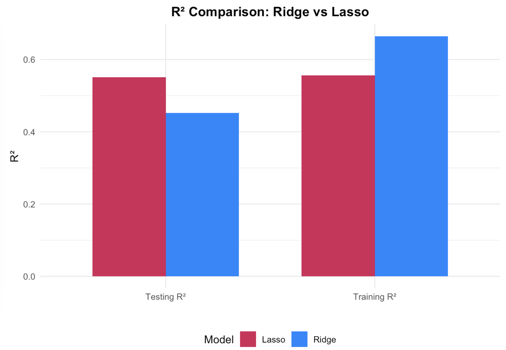
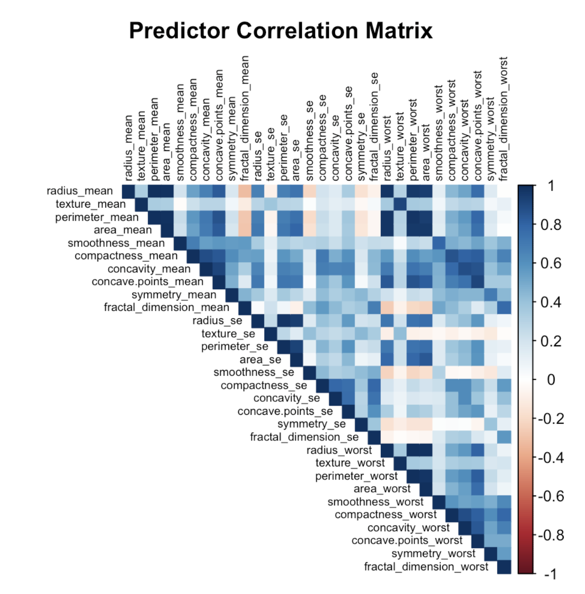
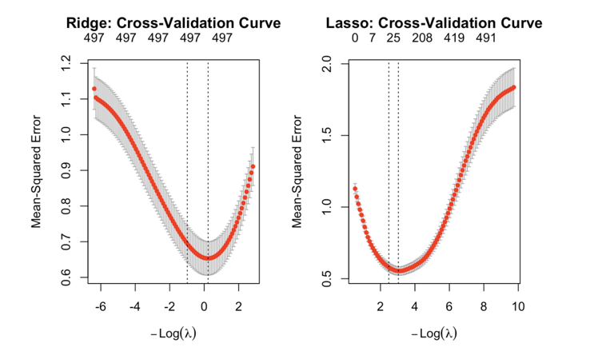

# Clinical Model Selection and Regularization

An empirical comparison of **stepwise regression, ridge, and lasso** across three biomedical prediction settings: low-dimensional clinical regression, correlated diagnostic features, and high-dimensional genomic data.

This repository is a portfolio-oriented project. It separates the analyses, removes machine-specific paths, documents the data, preserves contributor credit, and distinguishes predictive findings from clinical or causal claims.

## At a glance

| Dataset | Modeling setting | Methods | Headline result from the course analysis |
|---|---|---|---|
| Prostate cancer (`n=97`, `p=8`) | Low-dimensional continuous prediction | Full OLS, stepwise AIC/BIC | BIC selected `lcavol` and `lweight` and achieved the lowest reported test MSE (`0.49`) |
| Wisconsin Diagnostic Breast Cancer (`n=569`, `p=30`) | Correlated binary classification | Stepwise stability, ridge logistic regression | No predictor exceeded 80% selection frequency in the bootstrap analysis; ridge reached `96.9%` test accuracy |
| METABRIC (`n=1,904` raw, `p=693` raw) | High-dimensional prognostic prediction | Ridge and lasso | Lasso retained `47` of `497` modeled predictors and improved test RMSE (`0.71` vs. `0.79`) and test R² (`0.55` vs. `0.45`) |

The numbers above reproduce the final group report's original course run. The refactored scripts fix random seeds and improve path handling, so rerun values may differ slightly from the original unseeded split.

## Why this comparison matters

Biomedical predictors are often numerous and strongly correlated. That creates a practical choice:

- **Stepwise selection** produces compact models but can change sharply under resampling or a different information criterion.
- **Ridge** stabilizes correlated coefficients but retains every predictor.
- **Lasso** can produce a sparse model when the signal is concentrated in a smaller subset of features.

The project asks when each behavior is useful rather than treating one method as universally best.

## Key findings

### 1. Parsimony improved held-out performance in the prostate example

The full eight-variable model explained about 69% of training variation. AIC retained seven predictors, while BIC retained only `lcavol` and `lweight`. Despite its lower training R², the two-variable BIC model produced the lowest reported test MSE (`0.49`).

### 2. Correlation made discrete selection unstable

The Wisconsin dataset contains visible blocks of correlated size, perimeter, area, and derived measurements.



Across bootstrap samples, stepwise AIC/BIC repeatedly exchanged correlated predictors. The result is a useful warning: a selected variable is not automatically a uniquely important variable.



### 3. Sparsity helped in the high-dimensional METABRIC analysis

Using identical ten-fold cross-validation folds, ridge and lasso were compared on Nottingham Prognostic Index prediction. The course run found lower test error for lasso and a much smaller active set.





The selected genes should be interpreted as **predictive associations**, not validated biomarkers or causal effects.

## Repository structure

```text
.
├── analysis/
│   ├── 01_prostate_stepwise.Rmd
│   ├── 02_wdbc_ridge_stability.Rmd
│   └── 03_metabric_regularization.Rmd
├── data/
│   ├── README.md
│   └── breast_cancer_wisconsin.csv
├── docs/
│   └── course_report.pdf
├── figures/
├── CONTRIBUTORS.md
└── README.md
```

## Reproduce the analyses

1. Install R 4.3 or newer.
2. Install the required packages:

   ```r
   install.packages(c(
     "MASS", "glmnet", "caret", "corrplot", "dplyr",
     "tidyr", "ggplot2", "knitr", "rmarkdown"
   ))
   ```

3. Follow [`data/README.md`](data/README.md) to obtain the METABRIC file.
4. Render each analysis from the repository root:

   ```r
   rmarkdown::render("analysis/01_prostate_stepwise.Rmd")
   rmarkdown::render("analysis/02_wdbc_ridge_stability.Rmd")
   rmarkdown::render("analysis/03_metabric_regularization.Rmd")
   ```

## Scope and limitations

- This is an academic comparison, not a clinical decision system.
- Held-out results come from a single train/test split; repeated nested cross-validation would provide a stronger performance estimate.
- The train-test error gap is reported as a generalization diagnostic, not as a formal bias-variance decomposition.
- Feature selection does not establish causality or biological validity.
- No code license is asserted here because this was a group project; reuse requires permission from the contributors.

## Full report and contributors

- [Read the original group report](docs/course_report.pdf)
- [Contributor credits](CONTRIBUTORS.md)

## Data acknowledgements

- Prostate cancer example from *The Elements of Statistical Learning* data archive.
- Wisconsin Diagnostic Breast Cancer dataset: Wolberg, Mangasarian, Street, and Street (1993), UCI Machine Learning Repository, [DOI 10.24432/C5DW2B](https://doi.org/10.24432/C5DW2B), CC BY 4.0.
- METABRIC combined clinical and gene-expression file obtained from the Kaggle dataset linked in [`data/README.md`](data/README.md); its listed database/content licensing terms apply.

